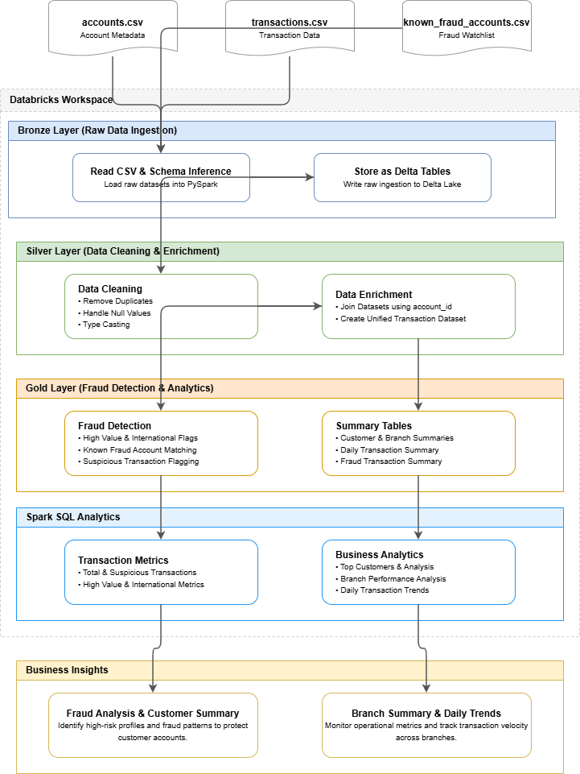
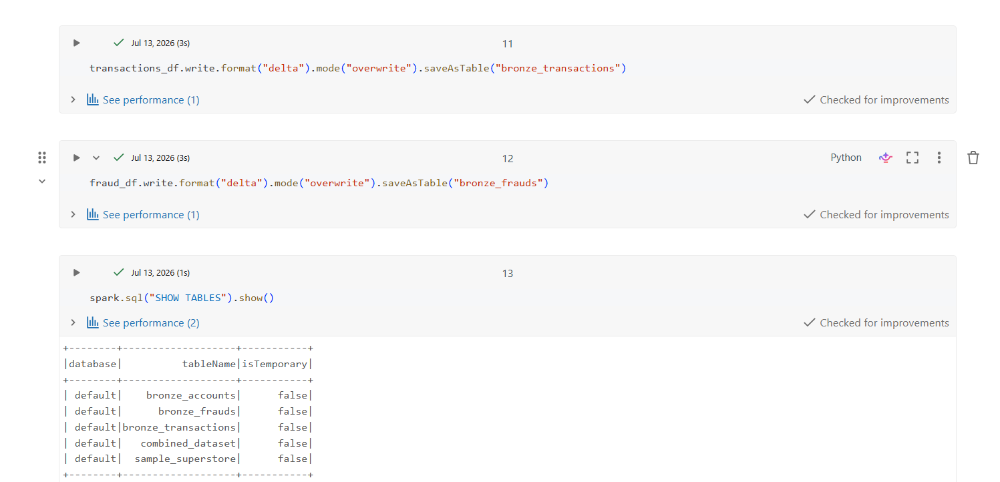
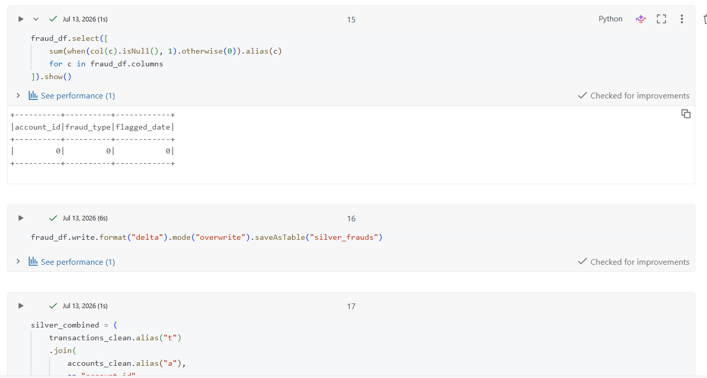
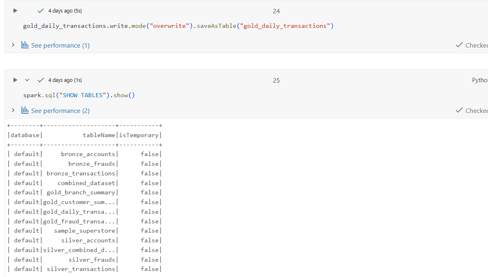
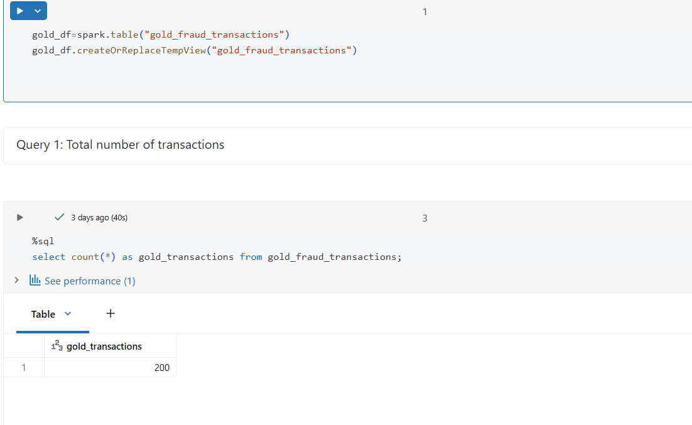

# 🛡️ Smart Fraud Detection Pipeline using PySpark & Databricks


## 📌 Project Overview

The **Smart Fraud Detection Pipeline** is an end-to-end data engineering project developed using **PySpark, Spark SQL, Databricks, and Delta Lake**. The pipeline follows the **Medallion Architecture (Bronze → Silver → Gold)** to process banking transaction data, detect suspicious transactions, and generate business insights.

---

## 🎯 Problem Statement

Financial institutions process large volumes of transaction data every day, making fraud detection a challenging task. This project builds a scalable data pipeline to clean, transform, and analyze banking data while identifying potentially fraudulent transactions using rule-based logic.

---

## ✨ Features

- Raw CSV data ingestion
- Medallion Architecture implementation
- Data cleaning and transformation
- Dataset integration using joins
- Rule-based fraud detection
- Delta Lake storage
- Spark SQL analytics

---

## 🏗️ Architecture



---

## 🛠️ Tech Stack

| Technology | Purpose |
|------------|---------|
| Python | Programming Language |
| PySpark | Data Processing |
| Spark SQL | Analytics |
| Databricks | Development Platform |
| Delta Lake | Storage |
| GitHub | Version Control |

---

## 📂 Dataset

The project uses three datasets:

- **accounts.csv** – Customer account information
- **transactions.csv** – Banking transaction records
- **known_fraud_accounts.csv** – Fraud watchlist

---

## ⚙️ Pipeline Workflow

### 🥉 Bronze Layer

- Read raw CSV files
- Schema inference
- Store data as Delta tables

### 🥈 Silver Layer

- Remove duplicates
- Handle null values
- Data type conversion
- Join datasets using **account_id**

### 🥇 Gold Layer

- High-value transaction detection
- International transaction detection
- Known fraud account identification
- Suspicious transaction flag generation
- Customer, branch, and daily summary tables

---

## 📊 SQL Analytics

Implemented Spark SQL queries for:

- Total transactions
- Suspicious transactions
- High-value transactions
- International transactions
- Top customers
- Branch analysis
- Customer analysis
- Daily transaction summary
- Fraud type distribution

---

## 📁 Project Structure

```text
Smart_Fraud_DetectionPipeline/
│
├── datasets/
├── notebooks/
├── screenshots/
├── architecture/
└── README.md
```

---

## 🚀 How to Run

1. Upload the CSV datasets to Databricks.
2. Execute the Bronze notebook.
3. Execute the Silver notebook.
4. Execute the Gold notebook.
5. Run the SQL Analytics notebook.

---

## 📸 Screenshots

### Bronze Layer



### Silver Layer



### Gold Layer



### SQL Analytics



---

## 📈 Results

- Successfully implemented a Medallion Architecture pipeline.
- Improved data quality through cleaning and transformation.
- Generated fraud detection flags for suspicious transactions.
- Created summary tables for customer, branch, and daily analysis.
- Produced business insights using Spark SQL.

---

## 🔮 Future Enhancements

- Real-time fraud detection using Spark Structured Streaming
- Machine Learning-based fraud prediction
- Power BI dashboard integration
- Apache Airflow workflow automation

---

## 👩‍💻 Author

**Nethra**
